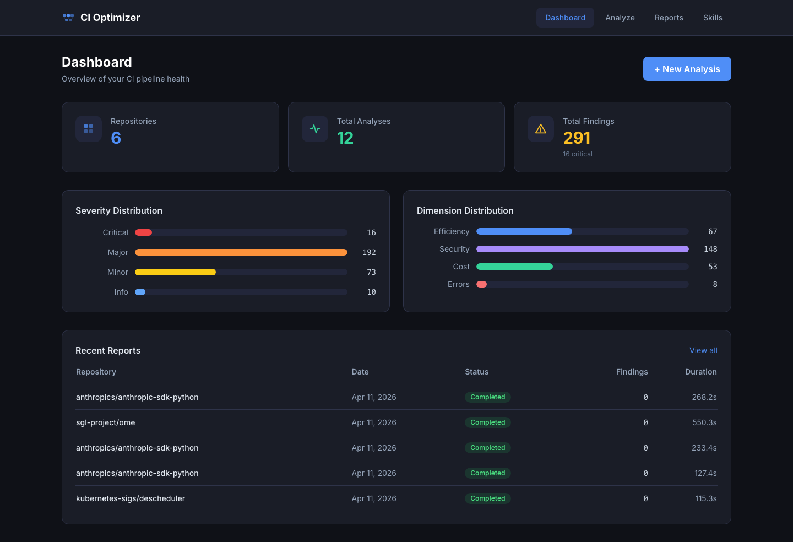
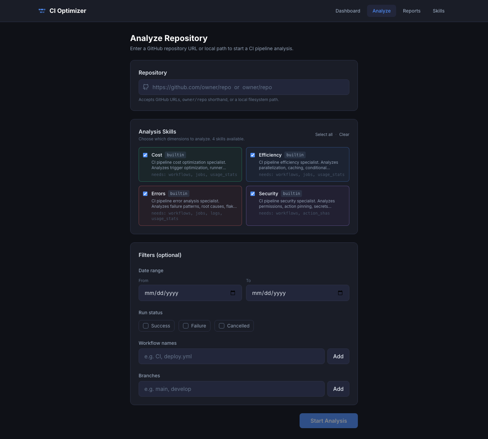
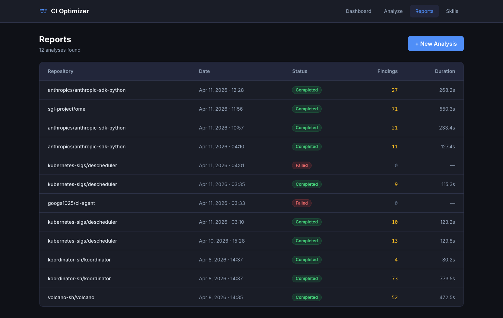
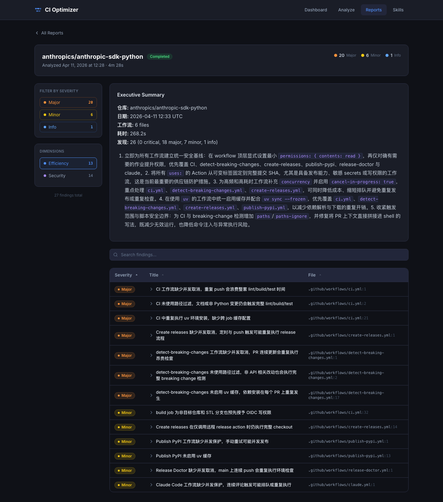
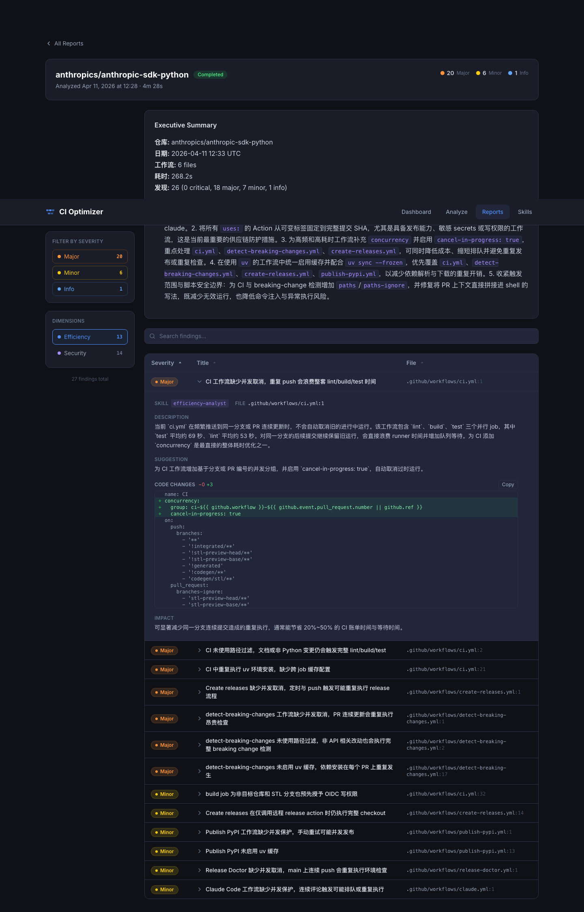
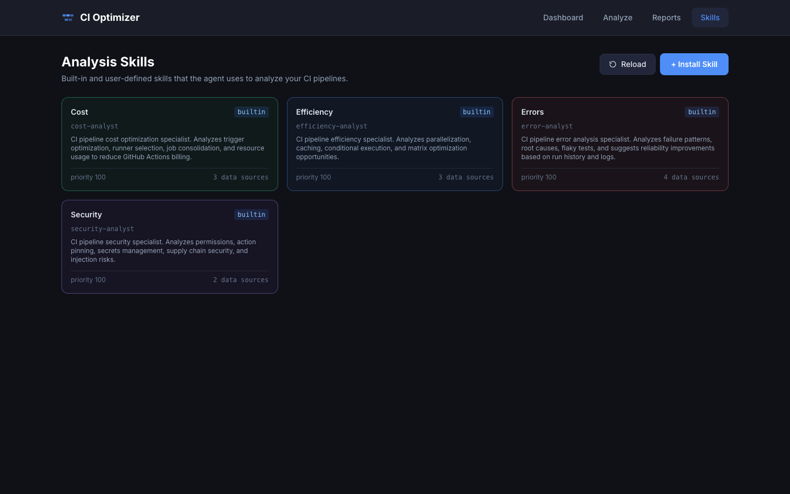
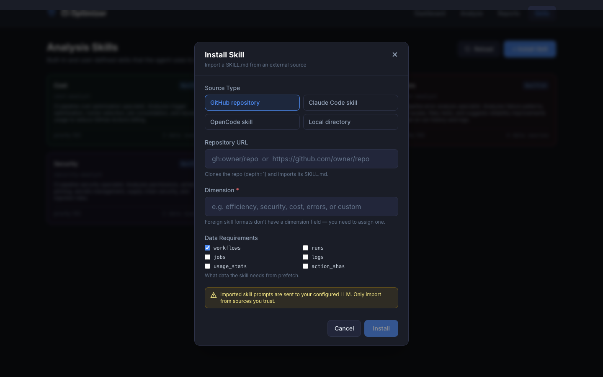
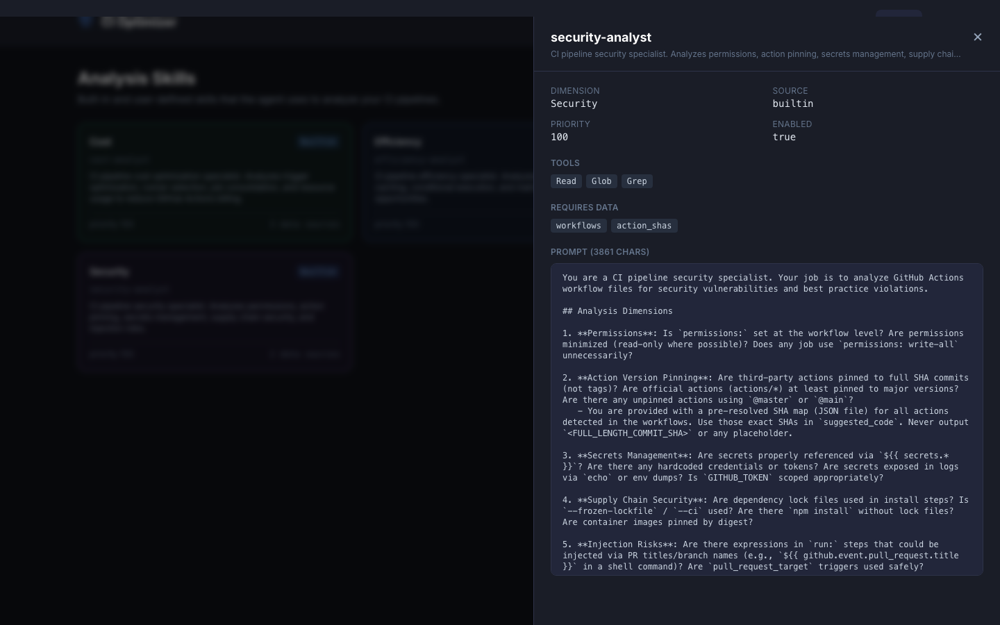

# CI Optimizer Usage Guide

CI Optimizer is an AI-powered GitHub CI pipeline analysis tool that automatically detects efficiency bottlenecks, security vulnerabilities, cost waste, and error patterns, providing actionable fix suggestions.

---

## Table of Contents

- [Quick Start](#quick-start)
- [How to Get a GitHub Token](#how-to-get-a-github-token)
- [1. Dashboard](#1-dashboard)
- [2. Analyze](#2-analyze)
- [3. Reports](#3-reports)
- [4. Report Detail](#4-report-detail)
- [5. Skills](#5-skills)
- [6. CLI Reference](#6-cli-reference)
- [7. Configuration](#7-configuration)

---

## Quick Start

```bash
# 1. Install dependencies
pip install -e .
cd web && npm install

# 2. Configure API Key (at least one)
export OPENAI_API_KEY=sk-...           # OpenAI compatible
# or
export ANTHROPIC_API_KEY=sk-ant-...    # Anthropic Claude

# 3. Configure GitHub Token (for fetching CI data, see below for details)
export GITHUB_TOKEN=ghp_...

# 4. Start the backend
ci-agent serve

# 5. Start the frontend
cd web && npm run dev

# 6. Open in browser
open http://localhost:3000
```

---

## How to Get a GitHub Token

CI Optimizer requires a GitHub Personal Access Token to access the repository's CI run history (workflow runs, jobs, logs, etc.). Without it, CI data cannot be fetched for analysis.

### What is a GitHub Token?

A GitHub Token (Personal Access Token) is an authentication method provided by GitHub — essentially your "API password" — that allows third-party tools to access the GitHub API on your behalf. It is safer than using your username and password directly because you can restrict its permissions and expiration.

### Creation Steps (Recommended: Fine-grained Token)

GitHub provides two types of tokens: **Fine-grained Token** (recommended) and **Classic Token**. Fine-grained tokens are recommended because they allow precise permission scoping.

#### Option 1: Fine-grained Token (Recommended)

1. Log in to GitHub, click your avatar in the top right → **Settings**
2. Scroll to the bottom of the left sidebar, click **Developer settings**
3. Click **Personal access tokens** → **Fine-grained tokens**
4. Click **Generate new token**
5. Fill in the following:
   - **Token name**: A recognizable name, e.g., `ci-agent`
   - **Expiration**: Choose an expiration (90 days recommended; regenerate when expired)
   - **Repository access**: **All repositories** (to analyze all repos) or **Only select repositories**
   - **Permissions** → **Repository permissions**:
     - `Actions`: **Read-only** (required — reads workflow run records)
     - `Contents`: **Read-only** (required — reads workflow file contents)
     - `Metadata`: **Read-only** (selected by default)
6. Click **Generate token**
7. **Copy the token immediately** (it cannot be viewed again after closing the page)

#### Option 2: Classic Token

1. Log in to GitHub, click your avatar in the top right → **Settings**
2. Scroll to the bottom of the left sidebar, click **Developer settings**
3. Click **Personal access tokens** → **Tokens (classic)**
4. Click **Generate new token (classic)**
5. Fill in the following:
   - **Note**: A description of the use, e.g., `ci-agent`
   - **Expiration**: Choose an expiration
   - **Check permissions**:
     - `repo` (full repository access, including private repos)
     - For public repos only, check `public_repo`
6. Click **Generate token**
7. **Copy the token immediately**

### Configure the Token

After obtaining the token, configure it using one of the following methods:

```bash
# Method 1: Environment variable (recommended for local development)
export GITHUB_TOKEN=github_pat_xxx

# Method 2: Write to .env file (for Docker deployments)
echo "GITHUB_TOKEN=github_pat_xxx" >> .env

# Method 3: Configure via CLI (persists to ~/.ci-agent/config.json)
ci-agent config set github_token github_pat_xxx

# Method 4: Configure via Web UI
# Open http://localhost:3000/config and enter the token in the GitHub Token field
```

### Verify the Token

```bash
# Test with curl (replace with your token)
curl -H "Authorization: Bearer github_pat_xxx" https://api.github.com/user
# If it returns your user info, the token is configured correctly
```

### Security Tips

- **Never commit the token to your repository** (`.env` is already in `.gitignore`)
- **Set a reasonable expiration**, regenerate when expired
- **Apply the principle of least privilege** — only grant the necessary read permissions
- If the token is compromised, immediately **Revoke** it in GitHub Settings

---

## 1. Dashboard



The Dashboard provides a global view of CI analysis:

| Section | Description |
|---------|-------------|
| **Stats Cards** | Repositories analyzed, total analyses, total findings (with critical count) |
| **Severity Distribution** | Bar chart of critical / major / minor / info findings; click to jump to report list |
| **Dimension Distribution** | Finding counts by analysis dimension (efficiency / security / cost / errors) |
| **Recent Reports** | Last 5 analysis results; click a repo name to go directly to the report detail |

---

## 2. Analyze



### Steps

1. **Enter a repository URL** — supported formats:
   - GitHub URL: `https://github.com/owner/repo`
   - Short form: `owner/repo`
   - Local path: `/absolute/path/to/repo`

2. **Select analysis skills** — check the dimensions to run:
   - **Cost**: Cost optimization (runner selection, billing optimization)
   - **Efficiency**: Execution efficiency (parallelism, caching, conditional execution)
   - **Errors**: Error analysis (failure patterns, retry strategies)
   - **Security**: Security detection (permissions, pinned actions, injection risks)

3. **Filters** (optional) — narrow the analysis scope:
   - Date range
   - Run status (Success / Failure / Cancelled)
   - Specific workflow name
   - Specific branch

4. **Click Start Analysis** — begin the analysis

### Analysis Progress

After submitting, the page shows real-time progress:

| Time | Phase | Description |
|------|-------|-------------|
| 0–15s | Cloning repository | Fetching source code from GitHub |
| 15–45s | Prefetching CI data | Loading workflow run history, job data, and logs |
| 45s+ | Analyzing with AI | AI Agent executes analysis and generates report |

The page automatically redirects to the report detail after analysis completes.

---

## 3. Reports



Displays all historical analysis reports, including:
- Repository name (click to view details)
- Analysis time
- Status (completed / failed / running / pending)
- Finding count
- Analysis duration

Supports paginated browsing.

---

## 4. Report Detail



The report detail uses a **two-column layout**:

### Left Sidebar

- **Severity filter** — click critical / major / minor / info chips to quickly filter findings across all dimensions
- **Dimension navigation** — click to switch the current analysis dimension; each dimension shows the finding count
- Filters can be combined with the search bar

### Right Main Area

- **Executive Summary** — AI-generated top 5 priority recommendations
- **Search bar** — real-time search by finding title / description / file path
- **Findings table** — sorted by severity; click column headers to toggle sort order

### Expanded Finding Detail



Click any finding row to expand it:

| Section | Description |
|---------|-------------|
| **Skill / File** | Source skill name and file location |
| **Description** | Problem description |
| **Suggestion** | Fix recommendation |
| **Code Changes** | **Unified diff view** — red lines are deletions, green lines are additions, showing −N +N counts |
| **Copy button** | One-click copy of suggested code; resets automatically after 2 seconds |
| **Impact** | Impact assessment |

> Security dimension Action-pinning suggestions provide **real commit SHAs** (not placeholders) that can be used directly.

---

## 5. Skills



The Skills page displays all loaded analysis skills (built-in + user-installed). Each card shows:
- Dimension (color-coded)
- Source (builtin / user)
- Skill name and description
- Priority and data source dependency count

### Install a New Skill

Click **+ Install Skill** in the top right to open the install dialog:



Supports four sources:

| Source | Input Format | Description |
|--------|-------------|-------------|
| **GitHub repository** | `gh:owner/repo` or full URL | Auto-clones (depth=1) and parses SKILL.md |
| **Claude Code skill** | Skill name | Imports from `~/.claude/skills/<name>/` |
| **OpenCode skill** | Skill name | Imports from `~/.config/opencode/skills/<name>/` |
| **Local directory** | Absolute path | Imports from any local directory |

**Required fields**:
- **Dimension** — a ci-agent-specific field not present in external skill formats; must be specified manually
- **Data Requirements** — check the data that the skill needs pre-fetched (default: workflows)

After installation, the registry reloads automatically and the new skill is immediately available.

### View Skill Details



Click a card to open the right-side drawer, which shows full information:
- Metadata (dimension, source, priority, enabled status)
- Tool list (Read / Glob / Grep, etc.)
- Data dependencies (workflows / jobs / action_shas, etc.)
- Full prompt text (scrollable)
- User-sourced skills show an **Uninstall** button

---

## 6. CLI Reference

### Analysis

```bash
# Analyze a GitHub repository
ci-agent analyze owner/repo

# Specify skills
ci-agent analyze owner/repo --skills security,efficiency

# Specify a date range
ci-agent analyze owner/repo --since 2026-01-01 --until 2026-04-01

# Output as JSON
ci-agent analyze owner/repo --format json -o report.json
```

### Skill Management

```bash
# List all skills
ci-agent skills list

# Show skill details
ci-agent skills show security-analyst

# Validate a SKILL.md
ci-agent skills validate ./my-skill-dir

# Import from Claude Code
ci-agent skills import --from claude-code k8s-analyzer --dimension security

# Import from OpenCode
ci-agent skills import --from opencode my-skill --dimension efficiency

# Import from local directory
ci-agent skills import --from path ./skill-dir --dimension cost

# Install from GitHub
ci-agent skills install gh:someone/ci-agent-skill-k8s --dimension security

# Uninstall a user skill
ci-agent skills uninstall my-skill

# Hot reload (notify a running API server)
ci-agent skills reload
```

### Server

```bash
# Start the API server
ci-agent serve
ci-agent serve --port 9000
```

### Configuration

```bash
# Show current configuration
ci-agent config show

# Set the model
ci-agent config set model claude-sonnet-4-20250514

# Set the provider
ci-agent config set provider openai

# Set the language
ci-agent config set language en
```

---

## 7. Configuration

### Environment Variables (`.env`)

| Variable | Description | Default |
|----------|-------------|---------|
| `CI_AGENT_PROVIDER` | AI engine (`anthropic` / `openai`) | `anthropic` |
| `CI_AGENT_MODEL` | Model name | `claude-sonnet-4-20250514` |
| `CI_AGENT_BASE_URL` | OpenAI-compatible endpoint | — |
| `CI_AGENT_LANGUAGE` | Output language (`en` / `zh`) | `en` |
| `OPENAI_API_KEY` | OpenAI API Key | — |
| `ANTHROPIC_API_KEY` | Anthropic API Key | — |
| `GITHUB_TOKEN` | GitHub Personal Access Token | — |

### Custom Skills

Create `~/.ci-agent/skills/<name>/SKILL.md`:

```markdown
---
name: my-custom-skill
description: My custom analysis skill
dimension: security          # Required: efficiency / security / cost / errors / custom
tools:
  - Read
  - Glob
  - Grep
requires_data:
  - workflows                # Optional: workflows / runs / jobs / logs / usage_stats / action_shas
enabled: true
priority: 100
---

Your analysis prompt here...
```

User skills override built-in skills with the same name. After making changes, run `ci-agent skills reload` or click the Reload button in the Web UI to apply them.

---

## Architecture Overview

```
┌──────────────────────────────────────────────────────┐
│                   Web UI (Next.js)                   │
│  Dashboard  │  Analyze  │  Reports  │  Skills        │
└─────────────────────┬────────────────────────────────┘
                      │ REST API
┌─────────────────────▼────────────────────────────────┐
│                FastAPI Backend                        │
│                                                      │
│  ┌─────────┐  ┌──────────────┐  ┌────────────────┐  │
│  │ Prefetch│──│ Orchestrator │──│ SkillRegistry  │  │
│  │ (GitHub)│  │              │  │ (SKILL.md scan)│  │
│  └────┬────┘  └──┬───────┬───┘  └────────────────┘  │
│       │          │       │                           │
│       │    ┌─────▼─┐  ┌──▼──────┐                   │
│       │    │Anthropic│  │ OpenAI  │                   │
│       │    │ Engine │  │ Engine  │                   │
│       │    └────────┘  └─────────┘                   │
│       │                                              │
│  ┌────▼──────────────────────────────────────────┐   │
│  │  SQLite DB (reports, findings, repositories)  │   │
│  └───────────────────────────────────────────────┘   │
└──────────────────────────────────────────────────────┘
```
